# Project Overview: Real-Time Transaction Fraud Detection System [(中文文档)](README_zh.md)

This system provides intelligent fraud detection and response for real-time transactions, ensuring fund security and business compliance. The main modules include:

## Core Modules

| Module | Description |
|----------------|---------------------------------------------------------------------------------------------------------------------------------|
| **Detection Rule Configuration** | Flexible configuration of fraud control rules such as amount thresholds, blacklists and transaction time windows. |
| **Blacklist Management** | Add, query and manage blacklist entries to block high-risk accounts. |
| **Transaction Notifications** | Record intercepted or alerted transactions. Supports queries and analysis by account, time and reason. |
| **Notification Maintenance** | Configure notification channels (email, Webhook, SMS) and keep logs and statuses. |


## 🎬 Project Preview Video

[](./preview-fraud-new.mp4)

<video width="640" height="360" controls>
  <source src="./preview-fraud-new.mp4" type="video/mp4">
  your browser do not support video。
</video>

## Related Documentation

| No. | Document | File Path                                                                       | Description |
|----|----------------------|---------------------------------------------------------------------------------|-----------------------------------|
| 1 | Deployment Guide | [deploy-detail.md](docs/deploy-detail_en.md)                                    | Deployment methods and environment configuration |
| 2 | Test Guide | [test-detail.md](docs/test-detail_en.md)                                        | Functional tests and API verification |
| 3 | JMeter Test Guide | [fraud_api_benchmark.md](docs/fraud_api_benchmark_en.md)                        | JMeter benchmark documentation |
| 4 | System Design (Markdown) | [fraud-design-detail.md](docs/fraud-design-detail_en.md)                        | Architecture design and module explanations |
| 5 | System Design (PDF) | [design-detail.pdf](docs/design-detail.pdf)                                     | Postman API collection |
| 6 | API Collection (Postman) | [fraud-local.postman_collection.json](docs/fraud-local.postman_collection.json) | Postman collection |
| 7 | Unit Test Report | [index.html](./htmlReport/index.html)                                             | Unit test summary |
| 8 | Enhancement Considerations | [extend-design.md](docs/extend-design_en.md)                                    | Ideas for further improvements |

## Test Environment
> **URL**: [http://121.43.35.48:8090/](http://121.43.35.48:8090/)

## Feature Screenshots
1. Detection rule configuration 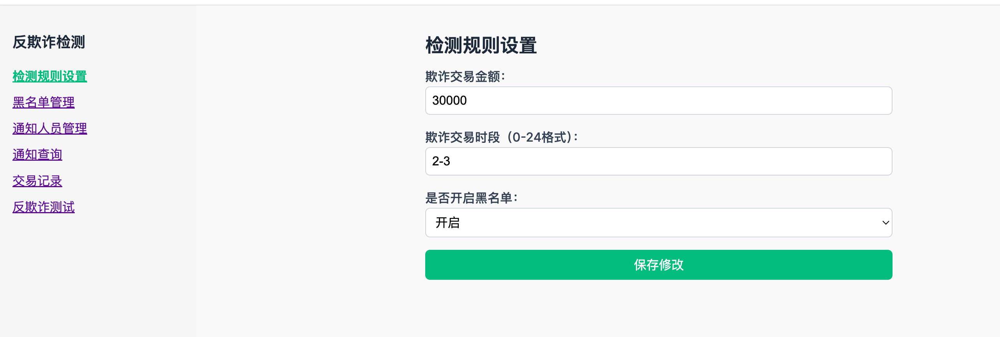
2. Blacklist management 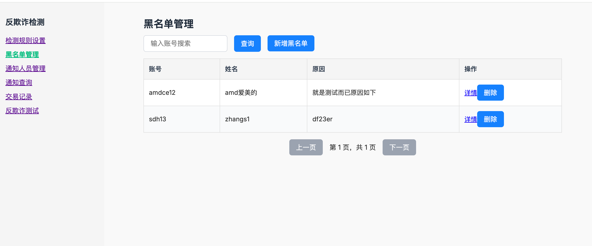
3. Transaction detection 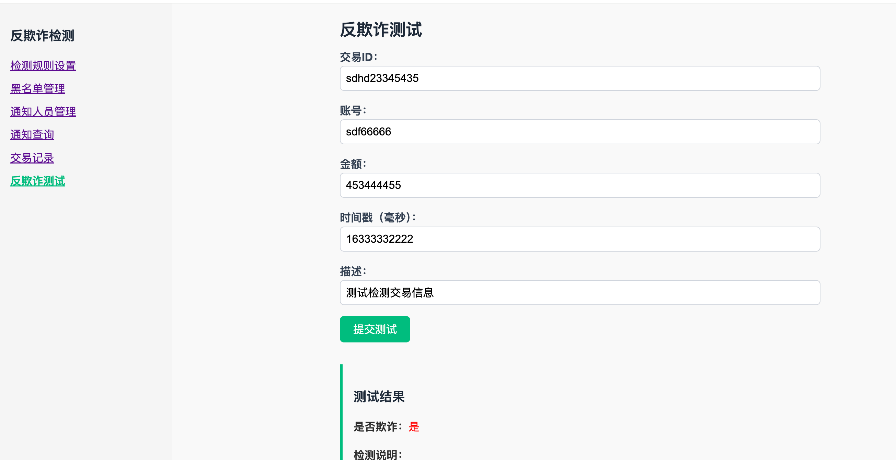 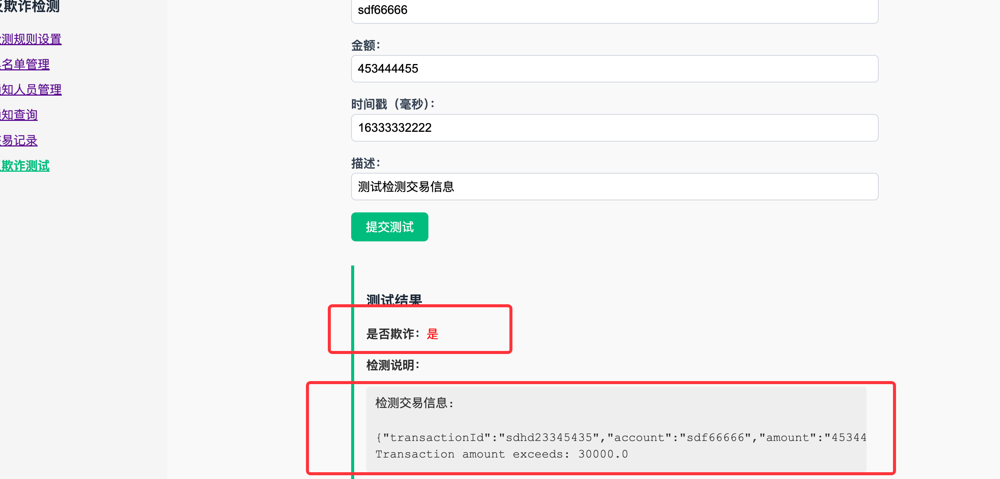

# 2. Local Development and Deployment Testing

## 1. Project Structure

The source code contains the following directories:

### 1.1 deploy Folder
Contains Kubernetes YAML files required for deployment:
- `fraud-deploy.yaml`: deploys the fraud application including service and configmap.
- `mysql-deploy.yaml`, `redis-deploy.yaml`, `rockermq-deploy.yaml`: optional components, adjust as needed for existing environments.

### 1.2 dockers Folder
Stores the `Dockerfile` used to build the fraud image.

### 1.3 docs Folder
Architecture, screenshots and other documentation.

### 1.4 libs Folder
Dependencies required for local runs. Before running locally, unzip `sct.zip` into your local Maven repository, for example:

```
${maven}/m2/repository/com
```
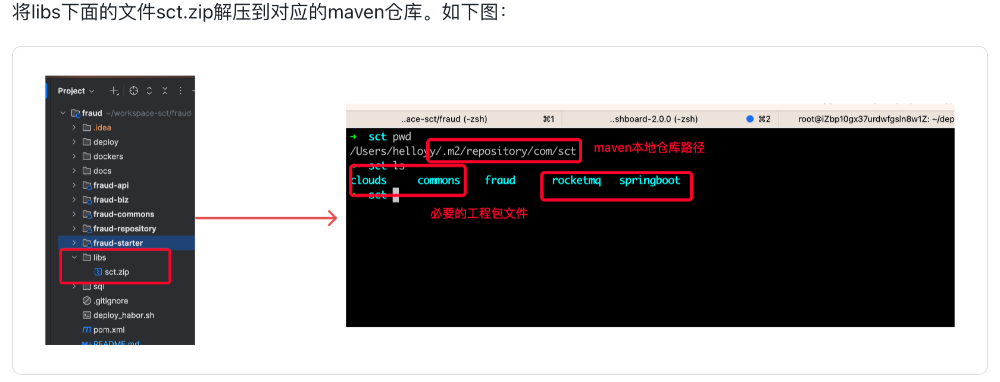

### 1.5 fraudfront Frontend
The frontend is built with **Vue 3 + Vite**. See [`fraudfront/README.md`](fraudfront/README.md) for compilation and startup instructions.
```bash
npm install
npm run dev   # default: http://localhost:5173
npm run build # production build
```

### 1.6 sql Folder
Contains [`sql/create-schema.sql`](sql/create_schema.sql) for database initialization.
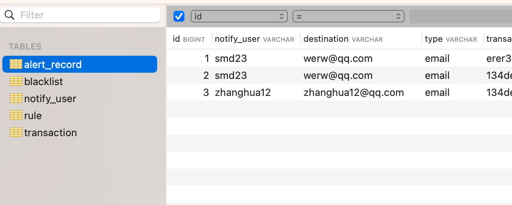

### 1.7 Module Structure
The modules are divided as follows:
- `fraud-api`, `fraud-starter`: internal service calls and REST startup interfaces.
- `fraud-biz`: core logic, including `service` and `cache` layers.
- `fraud-commons`: common utilities, enums, error codes and exception handling.
- `fraud-repository`: data persistence layer with DO models, mapper interfaces and `mapper.xml` files.
- Optional external modules such as `SAL` or `message`.

## 2. Local Run and API Testing

Uses Spring Boot 3.2, Maven, MySQL 8, Redis and RocketMQ.

### 2.1 Environment Setup
- Install JDK 21
- MySQL installation: [Alibaba Cloud docs](https://developer.aliyun.com/article/1039891)
- Redis installation: [official docs](https://redis.io/docs/latest/operate/oss_and_stack/install/archive/install-redis/)
- RocketMQ installation: [official docs](https://rocketmq.apache.org/zh/docs/quickStart/01quickstart)

### 2.2 Unpack Dependencies to Maven Repository

Unzip `libs/sct.zip` into your Maven path.

### 2.3 Edit Configuration Files

Configure the following in `application.yaml`:
- MySQL
- Redis
- RocketMQ

### 2.4 Start the Project
```bash
mvn clean install -Dmaven.test.skip=true
```
You can also start from IDE as shown below:
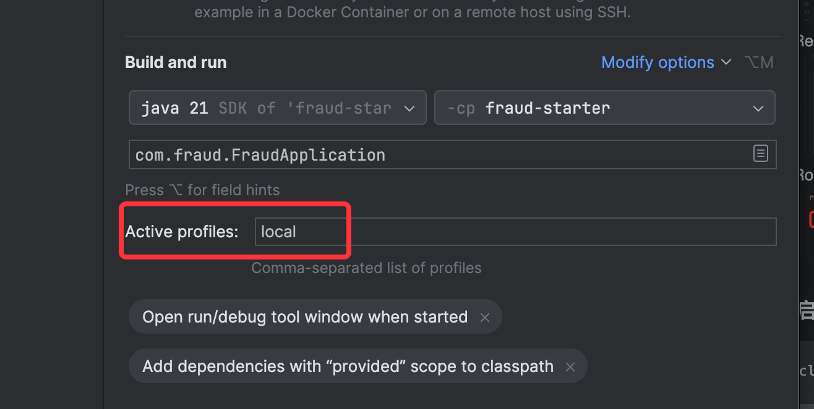
Once configured correctly the application should start successfully:
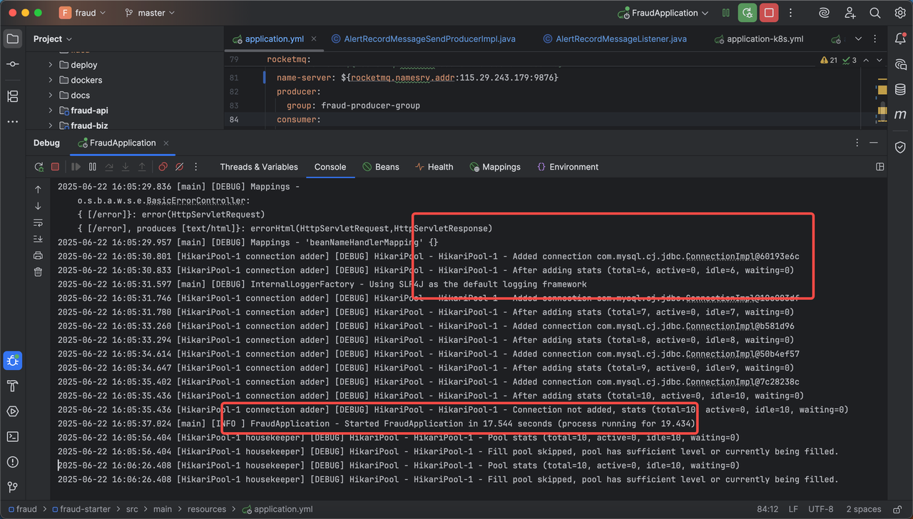

### 2.5 API Testing (Postman)
API docs: `docs/fraud-local.postman_collection.json`

**Test Points:**
- Rule creation and modification
- Blacklist APIs
- Transaction fraud detection (`/fraud/tx/evaluate`)

## 3. Code Notes

### 3.1 Unified API Response Wrapper
- Returns an `Object` in a unified format.
- Error codes include `code`, `debugInfo`, and `alertMessage`.
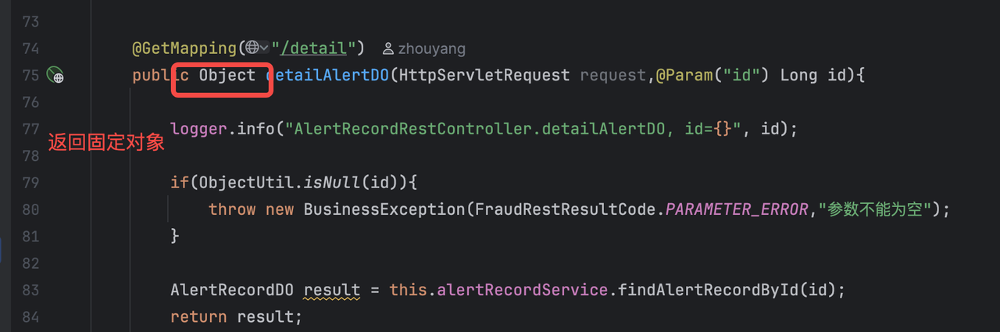
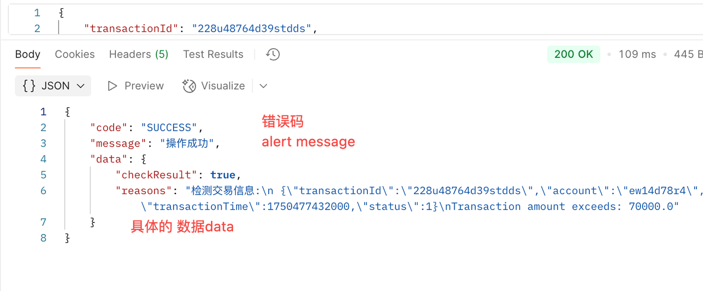

### 3.2 Unified Exception Handling
Encapsulates `BusinessException` with standardized error codes for debugging and user prompts.

### 3.3 Configuration Files
- `application.yaml`: default local development configuration
- `application-local.yaml`: local compilation testing
- `application-dev.yaml`: k8s development environment
- `application-k8sall.yaml`: MySQL/Redis/RMQ in the same cluster
- `application-k8sone.yaml`: database and cache deployed separately
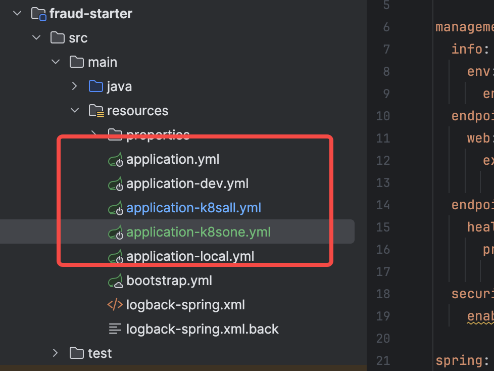

## 4. Starting the Frontend Locally

From the `fraudfront` directory run:
```bash
npm install
npm run dev
```
Default access: http://localhost:5173

To build for production:
```bash
npm run build
```
