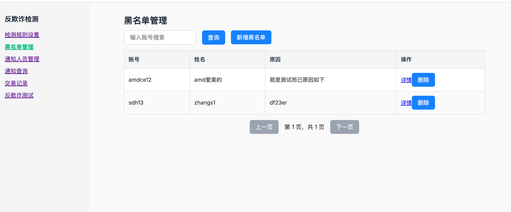
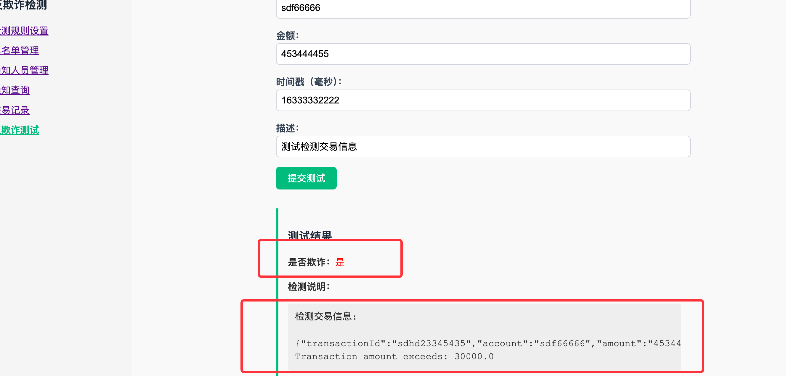
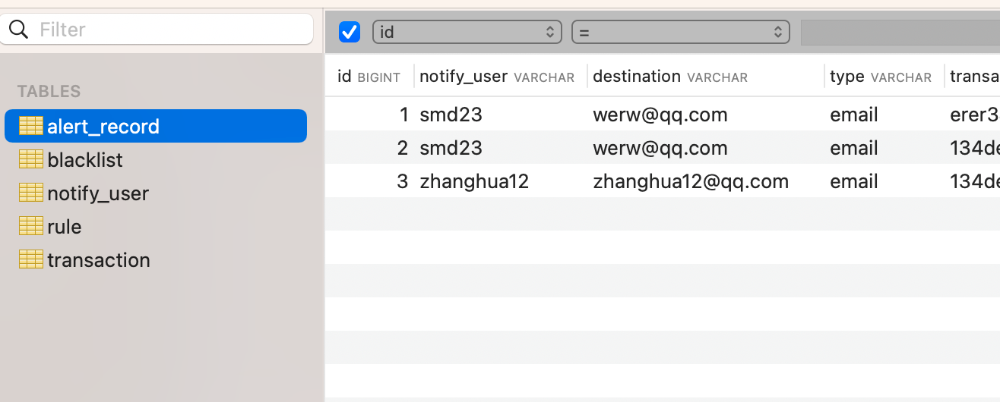
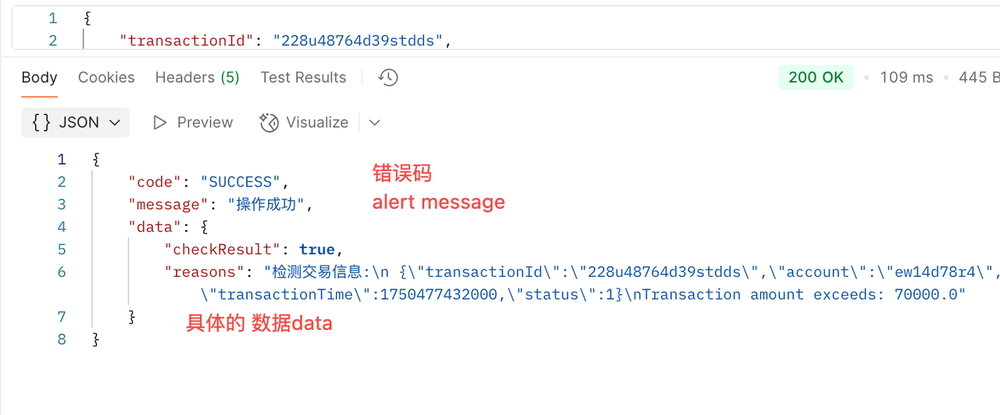

# 项目功能简介：实时交易欺诈检测系统

该系统旨在对实时交易进行智能欺诈识别与响应，保障资金安全与业务合规。核心功能模块包括：

## 核心功能模块

| 功能模块         | 描述                                                                 |
|------------------|----------------------------------------------------------------------|
| **检测规则设置** | 支持灵活配置多种交易风控规则（如金额阈值、黑名单、交易时段等）                  |
| **黑名单功能**   | 提供黑名单添加、查询、管理功能，用于拦截高风险账号                                   |
| **交易通知查看** | 记录被拦截/告警的交易信息，支持按账号、时间、原因等维度查询与分析                         |
| **通知维护**     | 支持通知发送配置（如：邮箱、Webhook、短信通道），并维护通知发送日志与状态                      |

## 相关设计文档

| 序号 | 文档名称         | 文件路径                                                                       | 描述                 |
|----|--------------|----------------------------------------------------------------------------|----------------------|
| 1  | 部署文档         | [deploy-detail.md](docs/deploy-detail.md)                                  | 系统部署方式与环境配置说明 |
| 2  | 测试文档         | [test-detail.md](docs/test-detail.md)                                      | 功能测试及接口验证说明 |
| 3  | jemter测试文档   | [test-detail.md](docs/fraud_api_benchmark.md)                              | jemter测试文档  |
| 4  | 系统设计文档md     | [fraud-design-detail.md](docs/fraud-design-detail.md)                      | 架构设计与功能模块说明 |
| 5  | 系统设计文档pdf    | [design-detail.pdf](docs/design-detail.pdf)                                | Postman 接口测试集合 |
| 6  | 接口文档（Postman） | [fraud-local.postman_collection.json](docs/fraud-local.postman_collection.json) | Postman 接口测试集合 |
| 7  | 单元测试报告       | [index.html](./htmlReport/index.html)                                        | 单元测试报告集合 |
| 8  | 功能优化考量设想     | [extend-design.md](docs/extend-design.md)                                  | 功能优化考量设想 |


## 🎬项目预览视频

该视频展示了系统主要功能与交互流程。建议使用 Chrome 或 Firefox 播放。

[<video width="640" height="360" controls>
  <source src="./preview-fraud-new.mp4" type="video/mp4">
  your browser do not support video。
</video>
](https://github.com/user-attachments/assets/4256aa4a-5184-4158-9e63-7b8d9f8cd447)

## 测试环境地址
> **环境地址**：[http://121.43.35.48:8090/](http://121.43.35.48:8090/)

## 功能截图
1. 检测规则设置
2. 黑名单功能
3. 交易检测功能

# 二. 本地开发与部署测试

## 1. 工程介绍与说明

整体工程源码包括以下几个目录和说明：

### 1.1 deploy 文件夹
存放部署所需的 Kubernetes 集群 YAML 文件：
- `fraud-deploy.yaml`: 用于部署 fraud 应用，包括 service、configmap 等。
- `mysql-deploy.yaml`、`redis-deploy.yaml`、`rockermq-deploy.yaml`: 部署辅助组件，如已有环境可按需修改。

### 1.2 dockers 文件夹
存放构建 fraud 镜像所需的 `Dockerfile` 文件。

### 1.3 docs 文件夹
包含架构、截图、说明文档等相关设计文档。

### 1.4 libs 文件夹
本地运行所需依赖包。在本地运行前需将 `sct.zip` 解压至 Maven 本地仓库，例如：

```
${maven}/m2/repository/com
```

### 1.5 fraudfront 是前端应用
该前端应用基于 **Vue 3 + Vite** 构建。你可以参考项目目录下的 [`fraudfront/README.md`](fraudfront/README.md) 进行本地编译与启动。
```bash
npm install
npm run dev   # 默认启动地址：http://localhost:5173
npm run build # 构建生产环境
```

### 1.6 sql 文件夹
包含 [`sql/create-schema.sql`](sql/create_schema.sql)，用于初始化数据库。


### 1.7 应用模块结构
模块划分如下：

- `fraud-api`、`fraud-starter`: 提供内部服务调用和 REST 启动接口。
- `fraud-biz`: 核心逻辑，包括 `service`、`cache` 层等。
- `fraud-commons`: 通用模块，包括工具类、枚举、错误码、异常处理等。
- `fraud-repository`: 数据持久层，包含 `DO`、`mapper` 接口与 `mapper.xml`。
- 可扩展外部模块如 `SAL`、`message` 等。

## 2. 本地运行与接口测试

使用 Spring Boot 3.2、Maven、MySQL 8、Redis、RocketMQ 等。

### 2.1 环境准备

- 安装 JDK 21
- MySQL 安装：[阿里云文档](https://developer.aliyun.com/article/1039891)
- Redis 安装：[官方文档](https://redis.io/docs/latest/operate/oss_and_stack/install/archive/install-redis/)
- RocketMQ 安装：[官方文档](https://rocketmq.apache.org/zh/docs/quickStart/01quickstart)

### 2.2 拷贝依赖包至 Maven 仓库

将 `libs/sct.zip` 解压至 Maven 路径下。

### 2.3 修改配置文件

编辑 `application.yaml` 中配置：
- MySQL
- Redis
- RocketMQ

### 2.4 启动工程

```bash
mvn clean install -Dmaven.test.skip=true
```
也可以idea启动如下所示：

确认无误后运行工程。正常启动结果如下：

### 2.5 接口测试（Postman）

接口文档见：`docs/fraud-local.postman_collection.json`

**测试点：**
- 检查规则创建与修改
- 黑名单接口
- 交易欺诈检测接口（/fraud/tx/evaluate）

## 3. 代码说明

### 3.1 接口统一返回封装

- `Object` 返回，统一格式。
- 错误码格式包括 `code`、`debugInfo`、`alertMessage`。




### 3.2 异常统一处理

封装 `BusinessException`，配合错误码标准，支持调试与用户提示。

### 3.3 配置文件说明

- `application.yaml`: 默认本地开发配置
- `application-local.yaml`: 启用本地编译测试
- `application-dev.yaml`: k8s 开发环境
- `application-k8sall.yaml`: MySQL/Redis/RMQ 在同一集群
- `application-k8sone.yaml`: 与数据库/缓存分离部署


## 4. 前端工程本地启动

在 `fraudfront` 目录下执行：

```bash
npm install
npm run dev
```

默认访问地址：http://localhost:5173

构建生产环境：

```bash
npm run build
```

