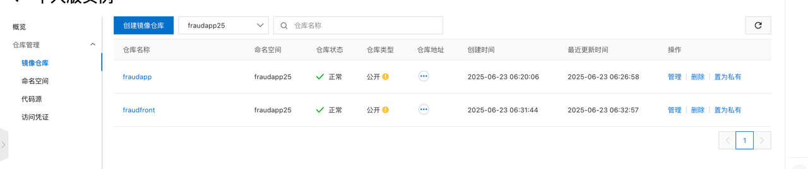
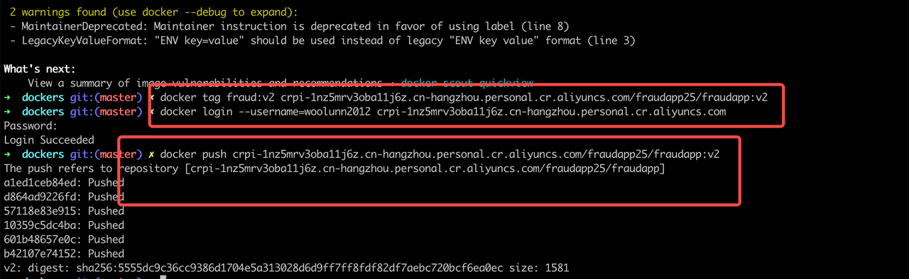
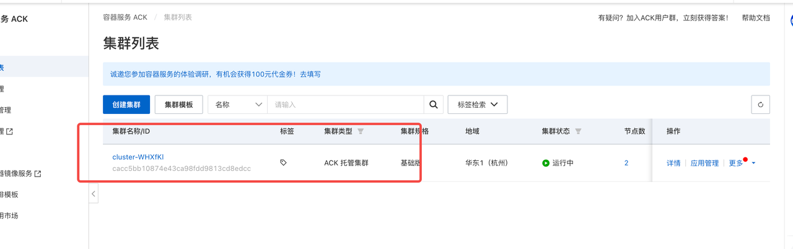
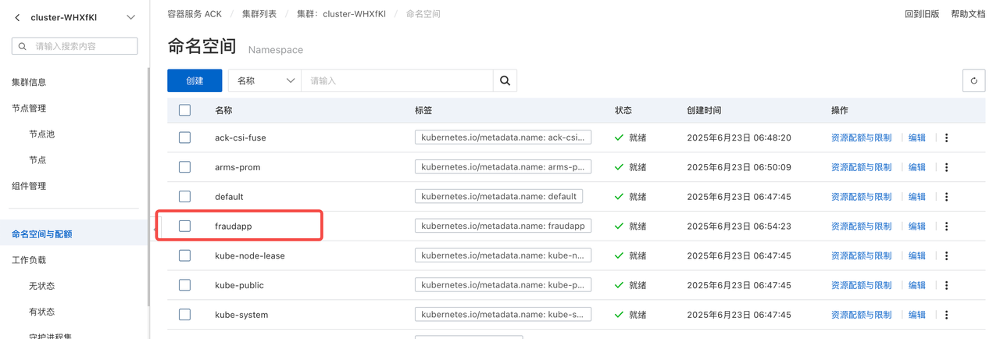
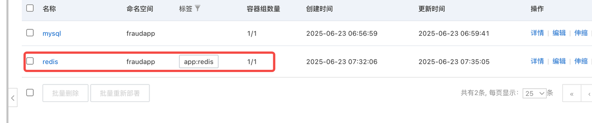
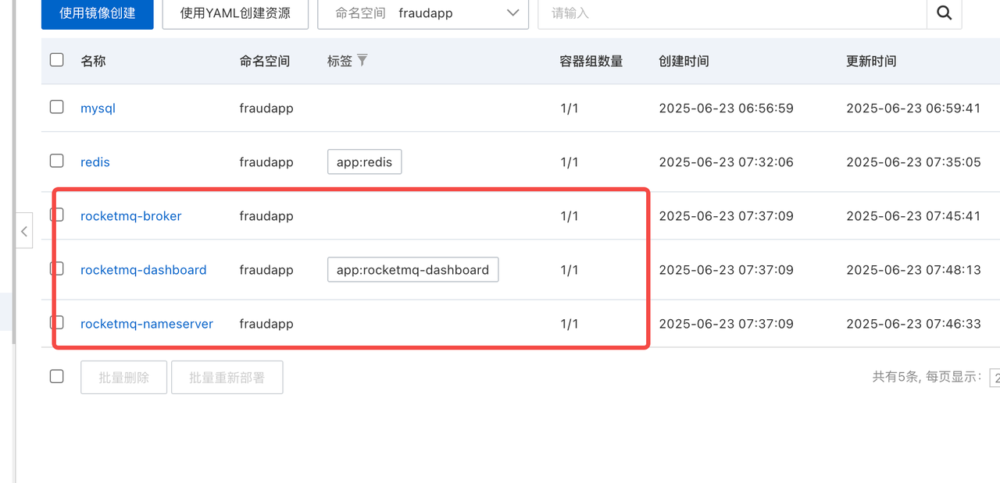
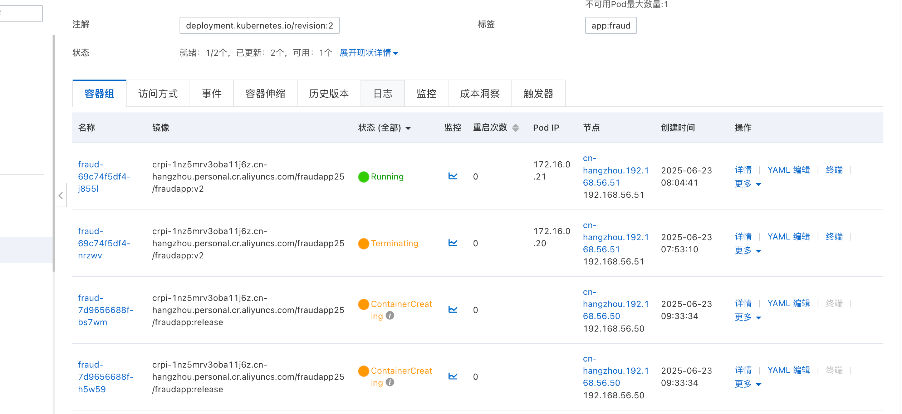

[返回 README_zh.md](../README_zh.md)

##  一. 🚀 线上测试环境部署

### 1. 制作镜像文件

两个应用fraudapp以及前端fraudfront以及制作完整的镜像到公开仓库，可以直接使用。地址如下
```bash
# fraduapp
crpi-1nz5mrv3oba11j6z.cn-hangzhou.personal.cr.aliyuncs.com/fraudapp25/fraudapp:release1.0

#fraudfont
crpi-1nz5mrv3oba11j6z.cn-hangzhou.personal.cr.aliyuncs.com/fraudapp25/fraudfront:release

```



#### 1.1 后端制作镜像文件

```bash
# 编译后端工程
mvn clean install -Dmaven.test.skip=true

# 拷贝 jar 包至 dockers 目录
cp fraud-starter/target/fraud.jar dockers/

# 构建镜像并打 tag，打包镜像命令如下，并且根据自己harbor或者其他镜像服务打tag即可使用。
cd dockers 
docker build -t "fraud:v2" .
docker tag fraud:v2 crpi-1nz5mrv3oba11j6z.cn-hangzhou.personal.cr.aliyuncs.com/fraudapp25/fraudapp:v2

# 推送镜像
docker push crpi-1nz5mrv3oba11j6z.cn-hangzhou.personal.cr.aliyuncs.com/fraudapp25/fraudapp:v2
```

> 镜像地址：`crpi-1nz5mrv3oba11j6z.cn-hangzhou.personal.cr.aliyuncs.com/fraudapp25/fraudapp:v2`



#### 1.2 前端工程制作镜像文件

```bash
# 在 fraudfront 目录执行
docker build -t fraudfront:latest .
docker tag fraudfront:latest harbor.streamcomputing.com/lark/fraudfraud:v1
```

> 注意：不同环境请根据实际修改 nginx.conf 配置


---

### 2. 阿里云或 K8S 环境部署说明

> 以下步骤用于测试部署，生产环境部署请根据实际情况整资源配置
> 因为涉及到基础以来组件：mysql、redis、rocketmq的部署。最小资源需求是8C16G的两个节点 。同时还要对其进行测试验证。k8s版本1.26.x版本为佳

#### 2.1 环境要求

- 至少 2 个节点，资源：8C16G
- K8S 推荐版本：v1.26.x
- 需要预置镜像仓库镜像
- 准备阿里云 ACK 容器服务或本地 K8S
- 以下方式按照的默认密码是，mysql: fraud123456 , redis: changeme1234



#### 2.2 部署步骤与验证

- **2.2.1 创建 Namespace**

```bash
kubectl create namespace fraudapp
```


- **2.2.2 部署 MySQL**
使用工程deploy目录下的mysql-deploy.yaml文件即可自动部署。同时会生成对应的Service信息等。确认容器组，服务等资源已经存下切正常。
同时创建mysql之后对数据进行初始化，导入工程下面sql目录下面create_schema.sql文件

使用 `deploy/mysql-deploy.yaml` 部署  
初始化数据脚本：`sql/create_schema.sql`


- **2.2.3 部署 Redis**

```bash
kubectl apply -f deploy/redis-deploy.yaml
```


- **2.2.4 部署 RocketMQ**
使用rocketmq-deploy.yaml文件进行rocketmq的部署。确保rocketmq可以正常运行以及使用。

```bash
kubectl apply -f deploy/rocketmq-deploy.yaml
```

- **2.2.5 部署 Fraud 后端服务**

> ⚠️ <span style="color:red">**注意**</span>：如果不是使用工程自带的 K8s 部署环境，请确保使用工程目录下的 `application.yaml` 配置文件，以保证服务能够正确运行。


```bash
kubectl apply -f deploy/fraud-deploy.yaml
```


- **2.2.6 部署前端服务**

> ⚠️ <span style="color:red">**注意**</span>：如使用不同的环境配置（例如开发环境、生产环境），请参考镜像制作中的说明，修改前端项目中的配置文件（如 `nginx.conf`、环境变量等）后再进行构建部署。

```bash
kubectl apply -f deploy/fraudfront-deploy.yaml
```

---

### 2.3 测试部署

- 已成功创建完整服务
- 已验证滚动更新与 Pod 最少保留策略

全部服务如下：


---

### 示例 HPA 自动扩容配置

```yaml
apiVersion: autoscaling/v2
kind: HorizontalPodAutoscaler
metadata:
  name: fraud-hpa
  namespace: fraudapp
spec:
  scaleTargetRef:
    apiVersion: apps/v1
    kind: Deployment
    name: fraud
  minReplicas: 2
  maxReplicas: 10
  metrics:
    - type: Resource
      resource:
        name: cpu
        target:
          type: Utilization
          averageUtilization: 30
```

---

### 节点故障与恢复测试流程

1. 创建 Deployment 副本数为 2 的服务
2. 模拟宕机：
   ```bash
   kubectl drain <节点名称> --ignore-daemonsets
   ```
3. 验证 Pod 是否成功调度到新节点
4. 测试滚动更新：至少保留一个pod服务。
---

### 滚动更新策略验证

- 已在 Deployment 中配置 `rollingUpdate` 策略
- 配合 `livenessProbe`、`readinessProbe` 实现平滑升级

