[Back to README](../README.md)

## I. 🚀 Online Testing Environment Deployment

### 1. Build Docker Images

We provide ready-to-use images for both the backend `fraudapp` and the frontend `fraudfront` in a public registry:
```bash
# fraudapp image
crpi-1nz5mrv3oba11j6z.cn-hangzhou.personal.cr.aliyuncs.com/fraudapp25/fraudapp:release1.0

# fraudfront image
crpi-1nz5mrv3oba11j6z.cn-hangzhou.personal.cr.aliyuncs.com/fraudapp25/fraudfront:release
```

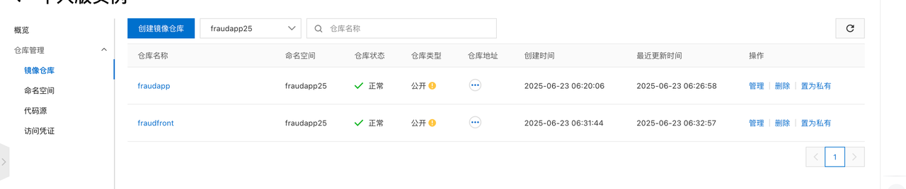

#### 1.1 Build the Backend Image
```bash
# compile the backend
mvn clean install -Dmaven.test.skip=true

# copy the jar into dockers directory
cp fraud-starter/target/fraud.jar dockers/

# build and tag the image, adjust the tag for your own registry
cd dockers
docker build -t "fraud:v2" .
docker tag fraud:v2 crpi-1nz5mrv3oba11j6z.cn-hangzhou.personal.cr.aliyuncs.com/fraudapp25/fraudapp:v2

# push the image
docker push crpi-1nz5mrv3oba11j6z.cn-hangzhou.personal.cr.aliyuncs.com/fraudapp25/fraudapp:v2
```

> Image URL: `crpi-1nz5mrv3oba11j6z.cn-hangzhou.personal.cr.aliyuncs.com/fraudapp25/fraudapp:v2`

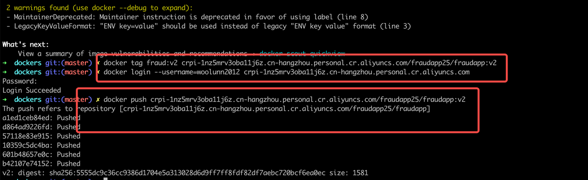

#### 1.2 Build the Frontend Image
```bash
# run inside the fraudfront directory
docker build -t fraudfront:latest .
docker tag fraudfront:latest harbor.streamcomputing.com/lark/fraudfraud:v1
```

> Note: update `nginx.conf` as needed for different environments.

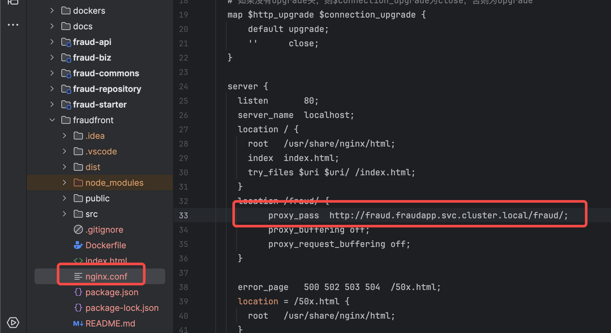

---

### 2. Deployment on Alibaba Cloud or K8S

> The following steps are for testing only. Adjust resources for production. Required components include MySQL, Redis and RocketMQ. Minimum recommended resources are two 8C16G nodes. Kubernetes version 1.26.x is preferred.

#### 2.1 Requirements

- At least two nodes with 8C16G resources
- Kubernetes version v1.26.x recommended
- Preconfigured image registry
- An Alibaba Cloud ACK cluster or local Kubernetes
- Default passwords are mysql: `fraud123456` and redis: `changeme1234`

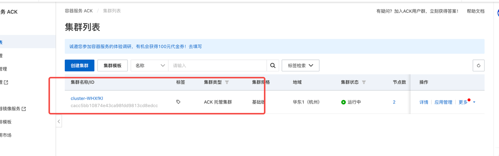

#### 2.2 Deployment Steps & Verification

- **2.2.1 Create a Namespace**
```bash
kubectl create namespace fraudapp
```
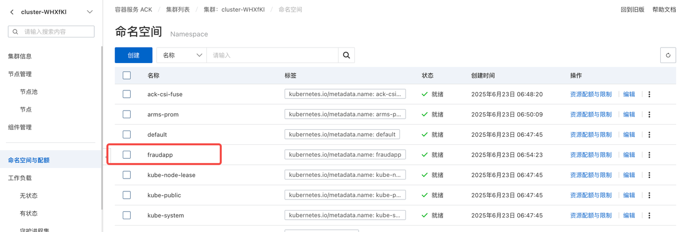

- **2.2.2 Deploy MySQL**
Use `deploy/mysql-deploy.yaml` to deploy MySQL and verify that the Pod and Service are running. After creation, initialize data using `sql/create_schema.sql`.

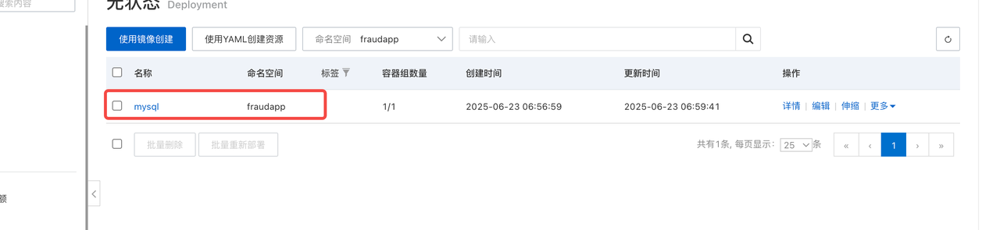
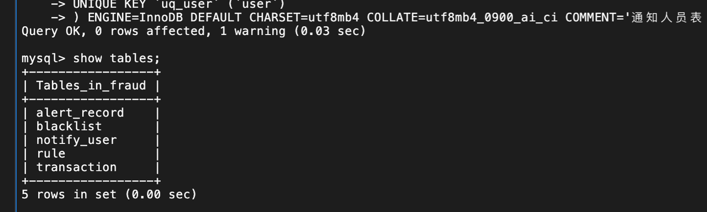

- **2.2.3 Deploy Redis**
```bash
kubectl apply -f deploy/redis-deploy.yaml
```
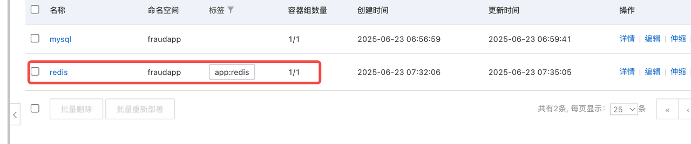

- **2.2.4 Deploy RocketMQ**
Deploy RocketMQ using `rocketmq-deploy.yaml` and ensure it is running.
```bash
kubectl apply -f deploy/rocketmq-deploy.yaml
```
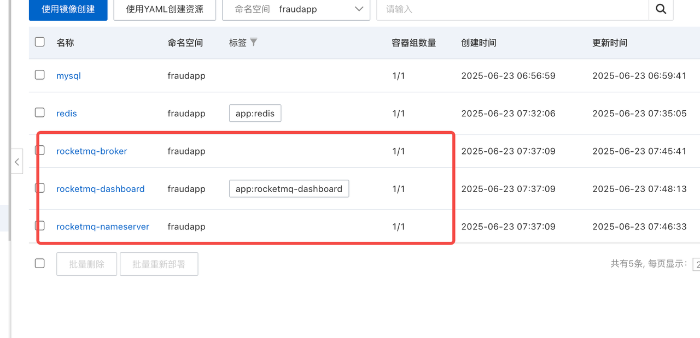

- **2.2.5 Deploy the Fraud Backend**

> ⚠️ **Note:** If you are not using the provided K8s environment, be sure to use the `application.yaml` included in the project to ensure the service runs correctly.
```bash
kubectl apply -f deploy/fraud-deploy.yaml
```

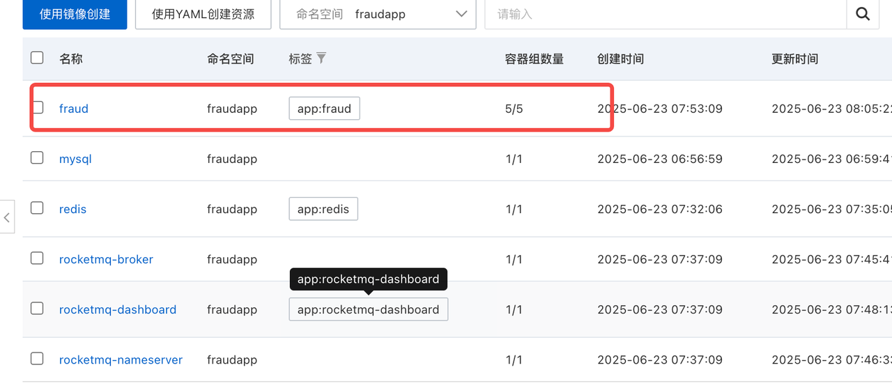
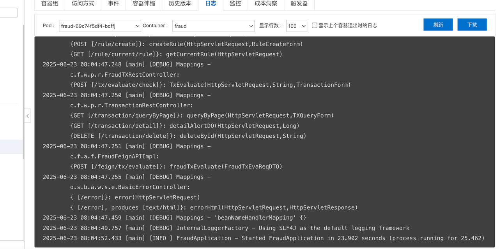

- **2.2.6 Deploy the Frontend**

> ⚠️ **Note:** For different environments (dev/prod), modify configuration files such as `nginx.conf` before building.
```bash
kubectl apply -f deploy/fraudfront-deploy.yaml
```

---

### 2.3 Test Deployment

- The full service stack has been created successfully
- Rolling updates and minimum available Pods have been verified

All services:
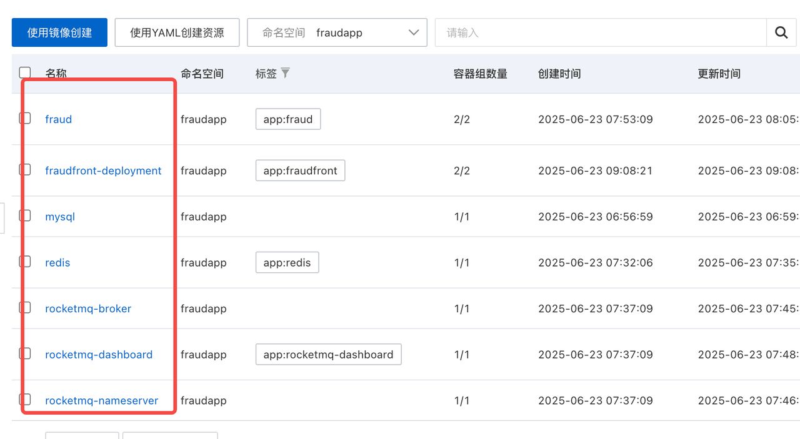

---

### Example HPA Auto-Scaling
```yaml
apiVersion: autoscaling/v2
kind: HorizontalPodAutoscaler
metadata:
  name: fraud-hpa
  namespace: fraudapp
spec:
  scaleTargetRef:
    apiVersion: apps/v1
    kind: Deployment
    name: fraud
  minReplicas: 2
  maxReplicas: 10
  metrics:
    - type: Resource
      resource:
        name: cpu
        target:
          type: Utilization
          averageUtilization: 30
```

---

### Node Failure & Recovery Test

1. Deploy a service with `Deployment` replicas set to 2.
2. Simulate node failure:
   ```bash
   kubectl drain <node-name> --ignore-daemonsets
   ```
3. Verify that Pods are rescheduled onto other nodes.
4. Test rolling update while keeping at least one Pod running.

---

### Rolling Update Strategy Verification

- `rollingUpdate` strategy configured in the Deployment
- Use `livenessProbe` and `readinessProbe` for smooth upgrades

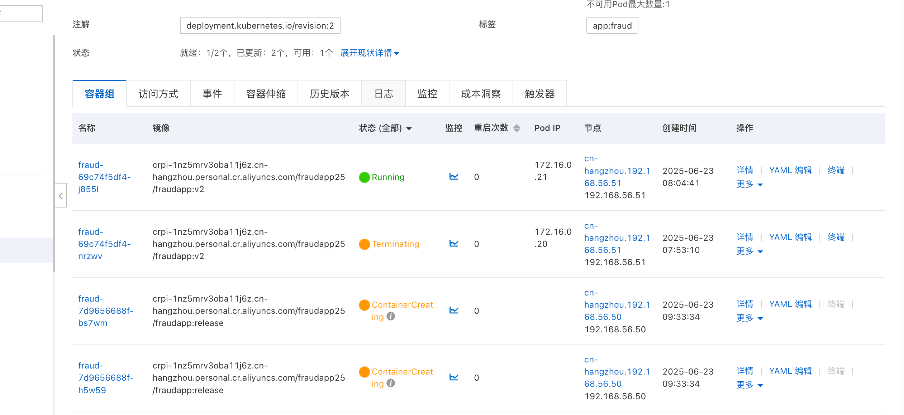
