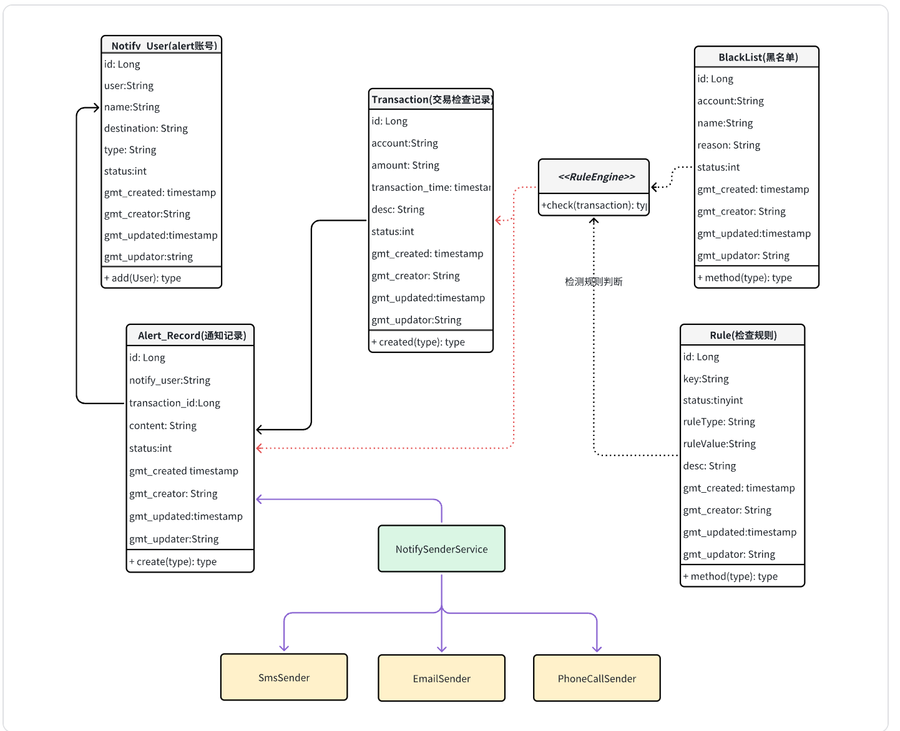
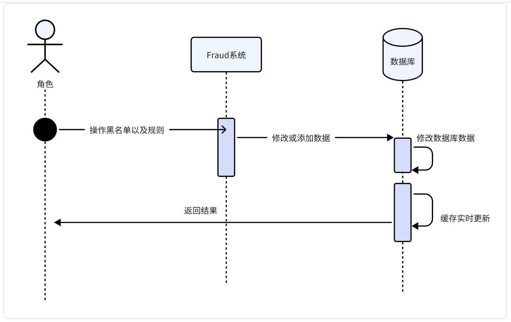

[返回 README_zh.md](../README_zh.md)

# 一. 技术方案设计

---

# 二. 业务与数据模型

## 1. 业务模型

## 2. 数据模型

### 2.1 `blacklist` 黑名单记录表

| 字段名     | 类型      | 长度 | 是否为空 | 说明                     |
|------------|-----------|------|----------|--------------------------|
| id         | long      | 20   | 否       | 黑名单 ID，自增主键     |
| account    | varchar   | 64   | 否       | 黑名单对应账户          |
| name       | varchar   | 64   | 否       | 黑名单对应名称          |
| reason     | varchar   | 2000 | 否       | 加入黑名单的原因        |
| status     | int       | 4    | 否       | 状态（0：正常）         |
| gmt_created| timestamp | -    | 否       | 创建时间                |
| gmt_creator| varchar   | 64   | 否       | 创建人                  |
| gmt_updated| timestamp | -    | 否       | 更新时间                |
| gmt_updater| varchar   | 64   | 否       | 更新人                  |

### 2.2 `rule` 检查规则表

| 字段名     | 类型      | 长度 | 是否为空 | 说明                             |
|------------|-----------|------|----------|----------------------------------|
| id         | long      | 20   | 否       | 规则 ID                          |
| key        | varchar   | 64   | 否       | 规则 KEY                         |
| rule_type  | varchar   | 64   | 否       | 规则类型（amount/blacklist/time）|
| value      | varchar   | 64   | 否       | 规则值（如1000、2-5、true）     |
| desc       | varchar   | 512  | 是       | 描述                             |
| status     | int       | 4    | 否       | 状态（0：正常）                 |
| gmt_created| timestamp | -    | 否       | 创建时间                         |
| gmt_creator| varchar   | 64   | 否       | 创建人                           |
| gmt_updated| timestamp | -    | 否       | 更新时间                         |
| gmt_updater| varchar   | 64   | 否       | 更新人                           |

### 2.3 `transaction` 交易检查记录表

| 字段名        | 类型      | 长度 | 是否为空 | 说明                                         |
|---------------|-----------|------|----------|----------------------------------------------|
| id            | long      | 20   | 否       | 交易主键                                     |
| transaction_id| varchar   | 128  | 否       | 原始交易 ID                                  |
| account       | varchar   | 64   | 否       | 账户                                         |
| amount        | varchar   | 128  | 否       | 金额                                         |
| transaction_time | timestamp | - | 否       | 交易时间                                     |
| desc          | varchar   | 2000 | 是       | 交易说明                                     |
| status        | int       | 4    | 否       | 检测结果（0: 正常未触发，1: 触发规则）       |
| reason        | varchar   | 2000 | 是       | 触发规则原因                                 |
| gmt_created   | timestamp | -    | 否       | 创建时间                                     |
| gmt_creator   | varchar   | 64   | 否       | 创建人                                       |
| gmt_updated   | timestamp | -    | 否       | 更新时间                                     |
| gmt_updater   | varchar   | 64   | 否       | 更新人                                       |

### 2.4 `alert_record` 告警通知记录表

| 字段名       | 类型      | 长度 | 是否为空 | 说明                         |
|--------------|-----------|------|----------|------------------------------|
| id           | long      | 20   | 否       | 告警记录主键                 |
| notify_user  | varchar   | 64   | 否       | 通知用户                     |
| destination  | varchar   | 64   | 否       | 通知目标（如邮箱、手机号）  |
| notify_type  | varchar   | 64   | 否       | 通知类型                     |
| transaction_id | long    | 20   | 否       | 关联交易 ID                  |
| amount       | varchar   | 128  | 否       | 交易金额                     |
| content      | varchar   | 2000 | 否       | 通知内容                     |
| status       | int       | 4    | 否       | 通知状态（0：正常）         |
| gmt_created  | timestamp | -    | 否       | 创建时间                     |
| gmt_creator  | varchar   | 64   | 否       | 创建人                       |
| gmt_updated  | timestamp | -    | 否       | 更新时间                     |
| gmt_updater  | varchar   | 64   | 否       | 更新人                       |

### 2.5 `notify_user` 通知人员表

| 字段名       | 类型      | 长度 | 是否为空 | 说明                                |
|--------------|-----------|------|----------|-------------------------------------|
| id           | long      | 20   | 否       | 主键 ID                             |
| user         | varchar   | 64   | 否       | 用户标识                            |
| name         | varchar   | 64   | 否       | 用户姓名                            |
| destination  | varchar   | 64   | 否       | 通知目标（如邮箱、手机号）         |
| type         | varchar   | 16   | 否       | 通知类型（SMS, Email, Phone）      |
| status       | int       | 4    | 否       | 状态（0：正常）                    |
| gmt_created  | timestamp | -    | 否       | 创建时间                            |
| gmt_creator  | varchar   | 64   | 否       | 创建人                              |
| gmt_updated  | timestamp | -    | 否       | 更新时间                            |
| gmt_updater  | varchar   | 64   | 否       | 更新人                              |

---

# 三. 业务流程

## 1. 维护数据相关业务流程

维护数据流程主要是规则修改，黑名单维护，查看交易数据，通知查看，维护通知人员信息等基本操作

- 黑名单维护
- 规则管理
- 交易数据查看
- 通知记录管理
- 通知人员管理

## 2. 实时检测交易流程

实时检测交易主要是检查交易是否发生触发规则，发送通知，记录交易信息等内容

- 检查交易触发规则
- 通知提醒
- 并发幂等控制

### 幂等控制说明：

为了防止重复提交错误提交等，在每次请求http header头里面新增一个"Idempotent-Token"，唯一的uuid值，放入缓存key中，
过期时间5秒钟，每次检查请求token是否存在，如果存在直接返回重复提交信息。

- 请求 header 加入 `"Idempotent-Token"` 唯一 UUID，5 秒过期；
- `transaction_id` 作为唯一索引避免重复；

- 分布式锁防止重复并发请求。
- 数据库对于transaction id 进行唯一主键索引，避免脏数据的出现 
- 同时针对RPC/GRPC调用的逻辑可以使用分布式锁进行锁定即可，可以避免并发和重复的问题

---

# 四. 部署发布策略设计

## 1. 开发测试环境部署

- 所有服务部署至 K8S（AP 应用、前端、MySQL、Redis、MQ）

## 2. 生产环境部署策略

### 2.1 数据库扩展

- 使用主从读写分离或阿里云 RDS 等托管服务

### 2.2 Redis 扩展

- Sentinel 高可用或阿里云 Tair 分布式缓存服务

### 2.3 MQ 扩展

- 使用 RocketMQ 主从，或托管 MQ（如阿里云 ONS）

### 2.4 应用扩展部署

- 多集群部署
- 域名代理分发
- 提高可用性

