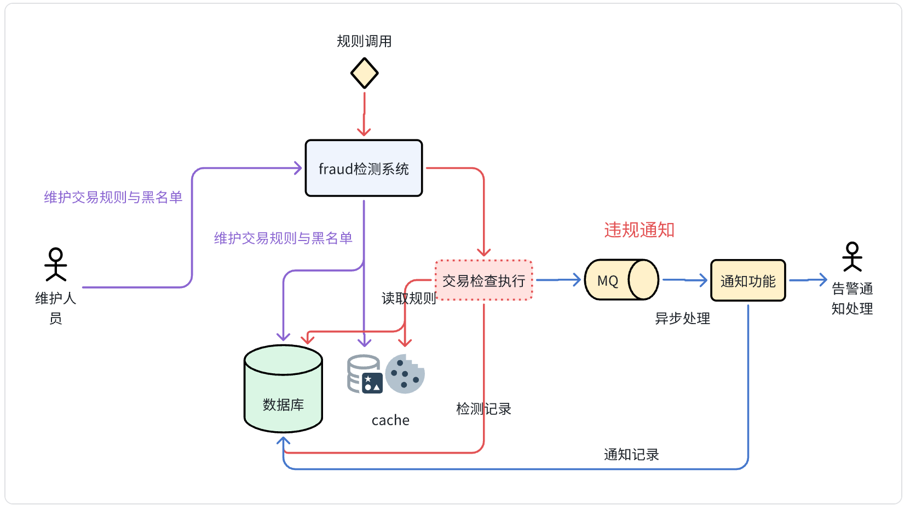

[Back to README](../README.md)

# I. Technical Architecture Design

---

# II. Business and Data Models

## 1. Business Model

## 2. Data Model

### 2.1 `blacklist` Table

| Column      | Type      | Length | Null | Description                |
|-------------|-----------|--------|------|----------------------------|
| id          | long      | 20     | no   | blacklist ID, auto-increment |
| account     | varchar   | 64     | no   | account in blacklist        |
| name        | varchar   | 64     | no   | name in blacklist           |
| reason      | varchar   | 2000   | no   | reason for blacklisting     |
| status      | int       | 4      | no   | status (0: normal)          |
| gmt_created | timestamp | -      | no   | create time                 |
| gmt_creator | varchar   | 64     | no   | creator                     |
| gmt_updated | timestamp | -      | no   | update time                 |
| gmt_updater | varchar   | 64     | no   | updater                     |

### 2.2 `rule` Table

| Column     | Type    | Length | Null | Description                    |
|------------|---------|--------|------|--------------------------------|
| id         | long    | 20     | no   | rule ID                        |
| key        | varchar | 64     | no   | rule key                       |
| rule_type  | varchar | 64     | no   | rule type (amount/blacklist/time) |
| value      | varchar | 64     | no   | rule value (e.g. 1000, 2-5, true) |
| desc       | varchar | 512    | yes  | description                    |
| status     | int     | 4      | no   | status (0: normal)             |
| gmt_created| timestamp| -     | no   | create time                    |
| gmt_creator| varchar | 64     | no   | creator                        |
| gmt_updated| timestamp| -     | no   | update time                    |
| gmt_updater| varchar | 64     | no   | updater                        |

### 2.3 `transaction` Table

| Column          | Type      | Length | Null | Description                                  |
|-----------------|-----------|--------|------|----------------------------------------------|
| id              | long      | 20     | no   | primary key                                  |
| transaction_id  | varchar   | 128    | no   | original transaction ID                      |
| account         | varchar   | 64     | no   | account                                      |
| amount          | varchar   | 128    | no   | amount                                       |
| transaction_time| timestamp | -      | no   | transaction time                             |
| desc            | varchar   | 2000   | yes  | transaction description                      |
| status          | int       | 4      | no   | result (0: normal, 1: triggered)             |
| reason          | varchar   | 2000   | yes  | reason for triggering                        |
| gmt_created     | timestamp | -      | no   | create time                                  |
| gmt_creator     | varchar   | 64     | no   | creator                                      |
| gmt_updated     | timestamp | -      | no   | update time                                  |
| gmt_updater     | varchar   | 64     | no   | updater                                      |

### 2.4 `alert_record` Table

| Column       | Type      | Length | Null | Description                        |
|--------------|-----------|--------|------|------------------------------------|
| id           | long      | 20     | no   | alert record ID                    |
| notify_user  | varchar   | 64     | no   | notified user                      |
| destination  | varchar   | 64     | no   | destination (email, phone)         |
| notify_type  | varchar   | 64     | no   | type of notification               |
| transaction_id| long     | 20     | no   | related transaction ID             |
| amount       | varchar   | 128    | no   | transaction amount                 |
| content      | varchar   | 2000   | no   | notification content               |
| status       | int       | 4      | no   | status (0: normal)                 |
| gmt_created  | timestamp | -      | no   | create time                        |
| gmt_creator  | varchar   | 64     | no   | creator                            |
| gmt_updated  | timestamp | -      | no   | update time                        |
| gmt_updater  | varchar   | 64     | no   | updater                            |

### 2.5 `notify_user` Table

| Column      | Type      | Length | Null | Description                       |
|-------------|-----------|--------|------|-----------------------------------|
| id          | long      | 20     | no   | primary ID                        |
| user        | varchar   | 64     | no   | user identifier                   |
| name        | varchar   | 64     | no   | user name                         |
| destination | varchar   | 64     | no   | notification destination          |
| type        | varchar   | 16     | no   | notification type (SMS, Email, Phone) |
| status      | int       | 4      | no   | status (0: normal)                |
| gmt_created | timestamp | -      | no   | create time                       |
| gmt_creator | varchar   | 64     | no   | creator                           |
| gmt_updated | timestamp | -      | no   | update time                       |
| gmt_updater | varchar   | 64     | no   | updater                           |

---

# III. Business Processes

## 1. Data Maintenance

Main flows include modifying rules, maintaining the blacklist, viewing transactions, managing notification records, and maintaining notification users.

- Blacklist maintenance
- Rule management
- View transaction data
- Manage notification records
- Manage notification users

## 2. Real-Time Transaction Checking

The system checks whether a transaction triggers any rule, sends notifications, and records the transaction details.

- Evaluate rules for each transaction
- Send notifications
- Concurrency idempotency control

### Idempotency Notes

To avoid duplicate submissions, each HTTP request includes an `Idempotent-Token` header containing a unique UUID. It is stored in cache with a 5-second expiration. If a token already exists, the request is considered a duplicate.

- The `Idempotent-Token` header carries a UUID and expires in 5 seconds.
- `transaction_id` is indexed to prevent duplicates.
- Distributed locks are used to avoid concurrent repeated requests.
- The database enforces unique primary keys on `transaction_id` to prevent dirty data.
- For RPC/GRPC calls, distributed locks can also be used to avoid concurrency issues.

---

# IV. Deployment Strategy

## 1. Development & Testing Environment

- All services run in K8S (application, frontend, MySQL, Redis, MQ)

## 2. Production Deployment Strategy

### 2.1 Database Scaling

- Master-slave with read/write splitting or Alibaba RDS

### 2.2 Redis Scaling

- Sentinel high availability or Alibaba Tair distributed cache

### 2.3 MQ Scaling

- RocketMQ master-slave or managed MQ such as Alibaba ONS

### 2.4 Application Deployment Expansion

- Multiple clusters
- Domain-based routing
- Higher availability

