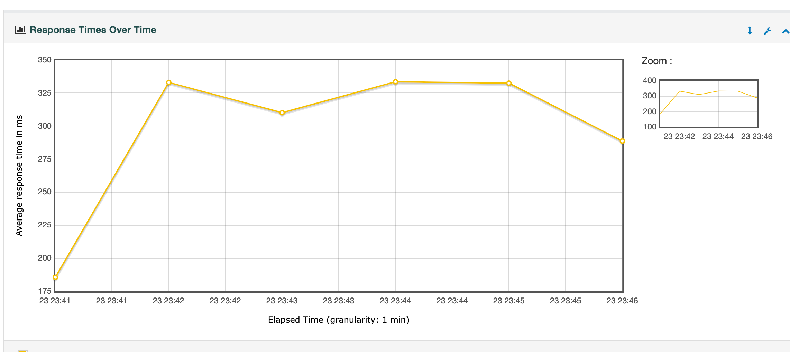

[返回 README_zh.md](../README_zh.md)

# 📊 接口性能压测报告

## 接口信息

| 项目              | 内容                                     |
|-------------------|------------------------------------------|
| 接口地址          | `http://121.43.35.48:8080/fraud/tx/evaluate/check` |
| 请求方法          | `POST`                                   |
| 请求参数示例      | `{ "transactionId": "228u48339stdds", "account": "ew185r4", "amount": "45659666", "transactionTime": 1750477432000, "description": "交易信454554息" }` |
| 请求头            | `Content-Type: application/json`         |

## 测试环境

10个并发测试计划文件[fraud-all-current-10u-10000loop-test-Plan.jmx](./fraud-all-current-10u-10000loop-test-Plan.jmx)

```shell
jmeter -n -t evaluate_tx_check_10u_10000loops.jmx -l result.csv -e -o report-html
```
受限于网络，资源等原因，测试结果有些影响

| 项目       | 配置                         |
|------------|----------------------------|
| 测试工具   | Apache JMeter v5.6         |
| 并发线程数 | 10                         |
| 循环次数   | 1000                       |
| 总请求数   | 100,00                     |
| 服务器配置 | 8C16G，Java 21，Spring Boot 3.2 |

## 主要性能指标

| 指标名称          | 数值      | 备注                       |
|-------------------|---------|----------------------------|
| 平均响应时间      | 298 ms  | 接口总体稳定               |
| 最大响应时间      | 7109 ms | 高并发下波动               |
| 最小响应时间      | 70 ms   | 资源充足时性能优           |
| 错误率            | 0.03%   | 少量请求失败（锁冲突等）  | |
| CPU 使用率        | 20%     | 压测时平均                 |
| 内存使用率        | 68%     | GC正常无明显 Full GC       |





测试报告地址[index.html](./report-html/index.html)

## 异常分析

- **失败请求样例**：
  ```json
  {
    "code": 2003,
    "message": "重复请求，正在处理中，请稍后重试"
  }
  ```