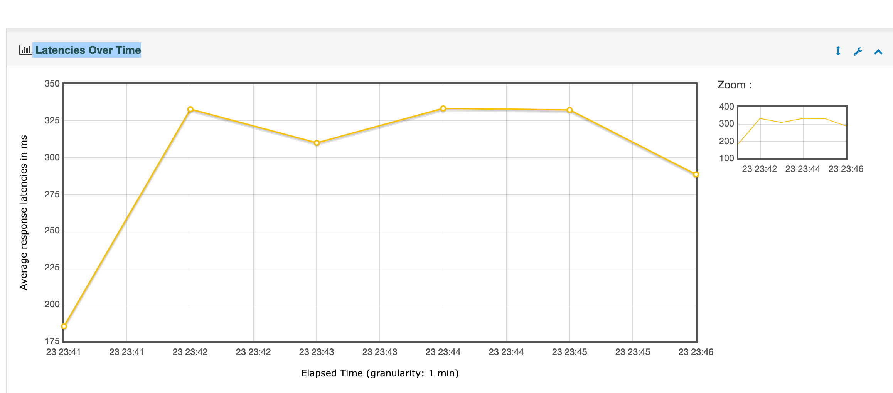

[Back to README](../README.md)

# 📊 API Performance Benchmark

[fraud-all-current-10u-10000loop-test-Plan.jmx](./fraud-all-current-10u-10000loop-test-Plan.jmx)

ue to network and resource limitations, the test results may be affected.


## API Details

| Item             | Content                                                     |
|------------------|-------------------------------------------------------------|
| Endpoint         | `http://121.43.35.48:8080/fraud/tx/evaluate/check`             |
| Method           | `POST`                                                      |
| Sample Request   | `{ "transactionId": "228u48339stdds", "account": "ew185r4", "amount": "45659666", "transactionTime": 1750477432000, "description": "transaction info" }` |
| Headers          | `Content-Type: application/json`                            |

## Test Environment

| Item        | Configuration               |
|-------------|-----------------------------|
| Tool        | Apache JMeter v5.6          |
| Threads     | 10                          |
| Loops       | 1000                        |
| Total Req   | 100,00                      |
| Server      | 8C16G, Java 21, Spring Boot 3.2 |

## Key Metrics

| Metric            | Value   | Notes                                |
|-------------------|---------|--------------------------------------|
| Avg Response Time | 298 ms  | Overall stable                       |
| Max Response Time | 7109 ms | Fluctuates under high concurrency    |
| Min Response Time | 70 ms   | Best case when resources are ample   |
| Error Rate        | 0.00%   | Few failures (lock conflicts, etc.)  |
| CPU Usage         | 20%     | Average during the test              |
| Memory Usage      | 68%     | GC stable, no obvious Full GC        |





test report [index.html](./report-html/index.html)
## Error Analysis

- **Failed Request Example:**
  ```json
  {
    "code": 2003,
    "message": "Duplicate request, processing in progress. Please retry later"
  }
  ```
