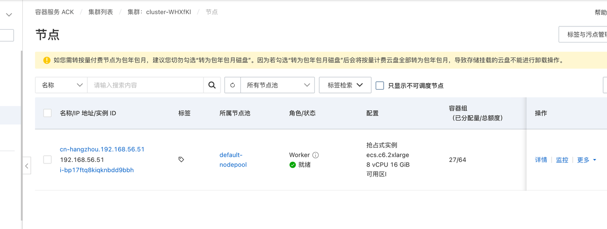
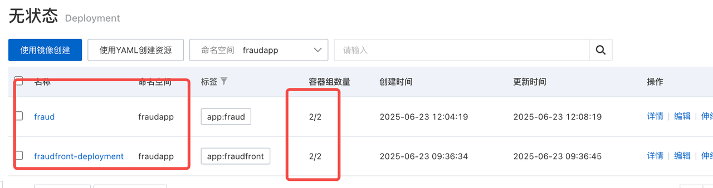

[返回 README_zh.md](../README_zh.md)

# 功能测试与验证

## 1. 测试环境业务验证

### 1.1 测试部署地址

测试环境已部署至阿里云测试地址：

- 🌐 地址：[http://115.29.243.179:8090/](http://115.29.243.179:8090/)

### 1.2 可用功能验证

- **1.2.1 交易规则查看与更新**

- **1.2.2 黑名单控制**

- **1.2.3 检查交易是否存在欺诈行为**


---

## 2. 关键检测接口集成测试验证

### 2.1 并发测试验证场景

| 测试方法名                                  | 说明                                                                 |
|--------------------------------------------|----------------------------------------------------------------------|
| `testEvaluateTx_NormalFlow`                | 正常命中所有规则，触发通知                                           |
| `testEvaluateTx_ConcurrentLockPrevented`   | 模拟锁获取失败，触发重复提交异常                                     |
| `testConcurrentLocking_OnlyOneThreadShouldPass` | 并发模拟下，确保只有一个线程执行业务，其余被锁拦截 |

#### 示例单元测试类：TXEvalEngineLockTest

```java
@ExtendWith(MockitoExtension.class)
public class TXEvalEngineLockTest {

    // mock 依赖
    private TXEvalEngine txEvalEngine;
    private BlackListService blackListService;
    private TxRuleLoader txRuleLoader;
    private TransactionService transactionService;
    private NotifyService notifyService;
    private LockService lockService;

    @BeforeEach
    void setUp() {
        // 初始化mock
    }

    @Test
    void testEvaluateTx_NormalFlow() {
        // 正常交易流程测试
    }

    @Test
    void testEvaluateTx_ConcurrentLockPrevented() {
        // 模拟锁冲突
    }

    @Test
    void testConcurrentLocking_OnlyOneThreadShouldPass() {
        // 多线程模拟并发请求
    }

    private TransactionDO buildTx(String id, String account, String amount) {
        // 构建交易对象
    }
}
```

---

### 2.2 MockMvc 接口调用测试

```java
@SpringBootTest(classes = FraudApplication.class)
@AutoConfigureMockMvc
class FraudTXRestControllerTest {

    @Autowired
    private MockMvc mockMvc;

    @MockBean
    private TXEvalEngine txEvalEngine;

    @Test
    void testCheckTxFraudAPI() throws Exception {
        // 构造请求参数并断言返回值
    }

    @Test
    void testCheckTx_Success() throws Exception {
        // JSON形式构造请求验证响应
    }
}
```

---

## 3. 单元测试说明

- 位于 `starter` 模块的 `test` 目录；
- 共计 **13 个测试类**，涵盖 **58 个测试用例**；
- 涉及接口校验、并发逻辑、异常处理等多项关键逻辑。
- 单元测试报告位于[htmlReport/index.html](../htmlReport/index.html)


---

## 4. 接口性能测试

- 针对主要交易验证接口进行压测，确保高并发场景下仍保持响应可控。
- **接口响应时间**：
  - 普通查询类接口 ≤ 100ms
  - 检查类接口 ≤ 500ms

- **并发性能**：
  - 单机支持并发请求数 ≥ 500QPS
  - 整体系统支持 ≥ 2000QPS

- **压测验证**：
  - 使用 JMeter、wrk 等工具进行接口压力测试
  - 在8C16G节点下模拟并发，达到指标要求后方可上线部署


## 5 部署验证与恢复测试

### 5.1 自动扩容测试（HPA）

```yaml
apiVersion: autoscaling/v2
kind: HorizontalPodAutoscaler
metadata:
  name: fraud-hpa
  namespace: fraudapp-fraud
spec:
  scaleTargetRef:
    apiVersion: apps/v1
    kind: Deployment
    name: fraud
  minReplicas: 2
  maxReplicas: 10
  metrics:
    - type: Resource
      resource:
        name: cpu
        target:
          type: Utilization
          averageUtilization: 30
```

### 5.2 节点故障测试

- 步骤：
1. 在节点上部署一个双副本服务； 
2. 使用 `kubectl drain <节点名称>` 模拟宕机； 
3. 观察 Pod 自动迁移并恢复正常运行。 
4. 当集群从两个节点变成一个节点后，应用仍然正常运行：



### 5.3 滚动升级验证

- 已在 Deployment 中设置滚动更新策略和存活探针；
- 实测部署时至少保持一个 Pod 可用。

---

