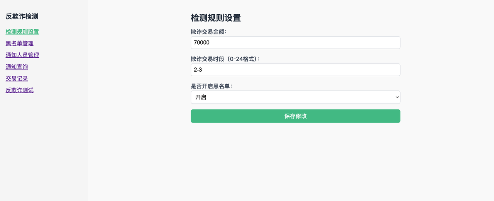
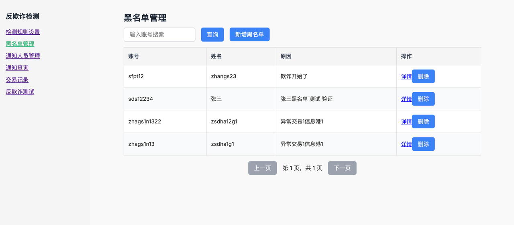
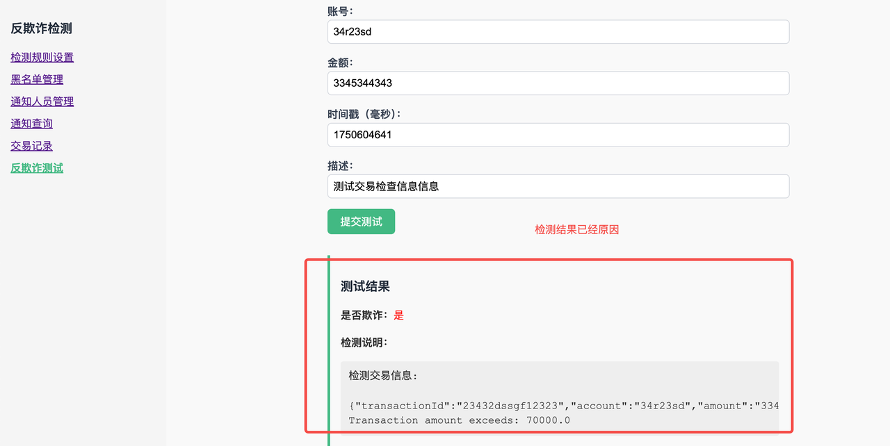
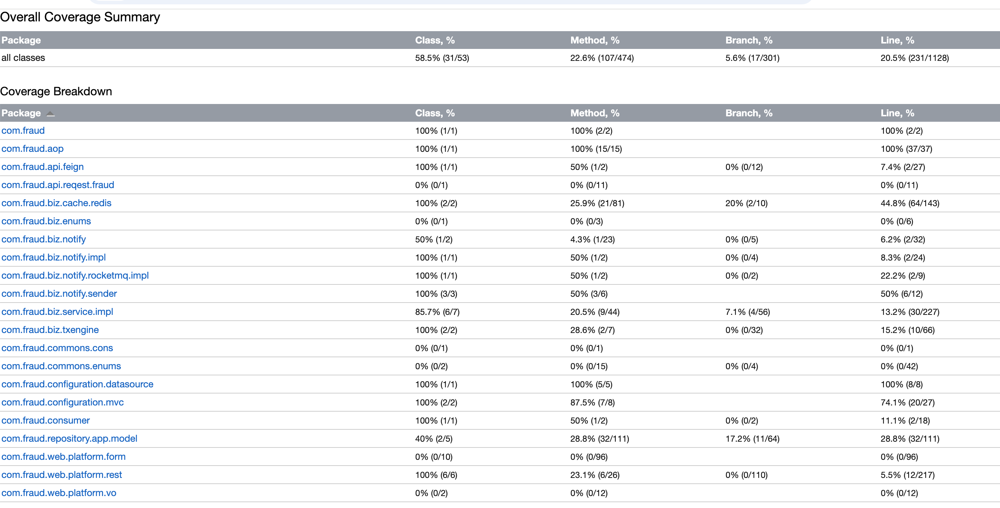
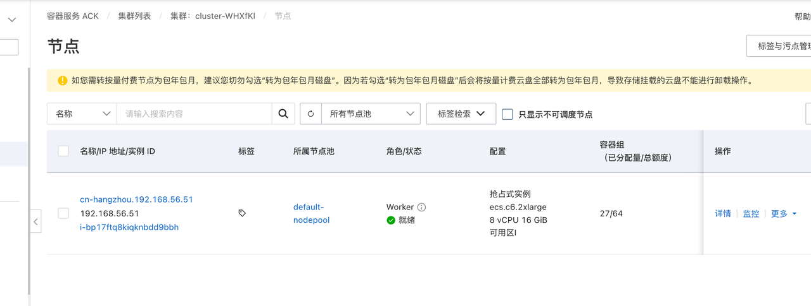
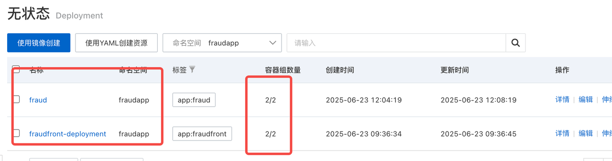
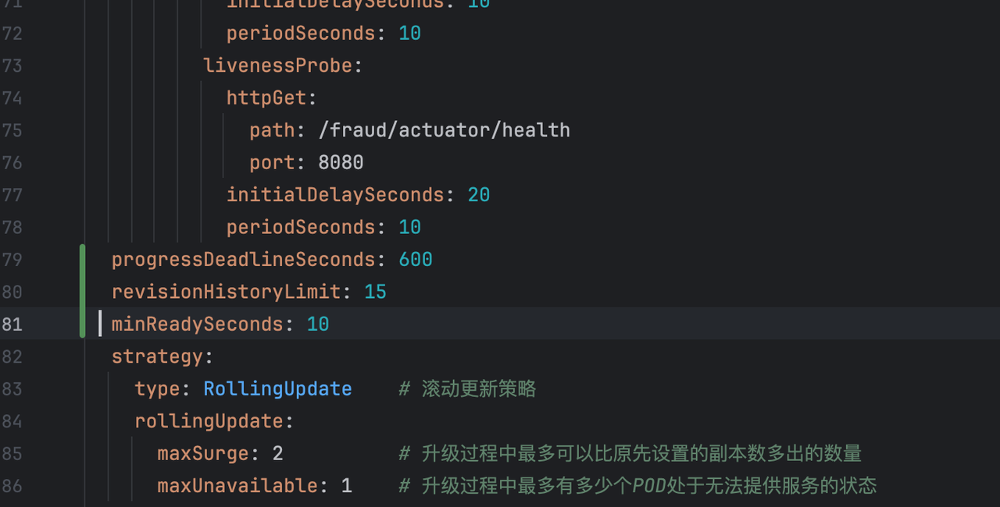

[Back to README](../README.md)

# Function Testing and Validation

## 1. Verification in the Test Environment

### 1.1 Test Deployment URL

The test environment is deployed at the following address:

- 🌐 [http://115.29.243.179:8090/](http://115.29.243.179:8090/)

### 1.2 Available Feature Checks

- **1.2.1 View and Update Rules**

- **1.2.2 Blacklist Control**

- **1.2.3 Check Transactions for Fraud**


---

## 2. Integration Tests for Key APIs

### 2.1 Concurrent Test Scenarios

| Test Method                                   | Description                                              |
|-----------------------------------------------|----------------------------------------------------------|
| `testEvaluateTx_NormalFlow`                   | All rules triggered and notifications sent               |
| `testEvaluateTx_ConcurrentLockPrevented`      | Simulate lock acquisition failure and duplicate submit error |
| `testConcurrentLocking_OnlyOneThreadShouldPass` | Under concurrency ensure only one thread processes and others are blocked |

#### Sample Test Class: `TXEvalEngineLockTest`
```java
@ExtendWith(MockitoExtension.class)
public class TXEvalEngineLockTest {

    // mocked dependencies
    private TXEvalEngine txEvalEngine;
    private BlackListService blackListService;
    private TxRuleLoader txRuleLoader;
    private TransactionService transactionService;
    private NotifyService notifyService;
    private LockService lockService;

    @BeforeEach
    void setUp() {
        // initialize mocks
    }

    @Test
    void testEvaluateTx_NormalFlow() {
        // normal transaction flow test
    }

    @Test
    void testEvaluateTx_ConcurrentLockPrevented() {
        // simulate lock conflict
    }

    @Test
    void testConcurrentLocking_OnlyOneThreadShouldPass() {
        // multi-threaded concurrency request simulation
    }

    private TransactionDO buildTx(String id, String account, String amount) {
        // build transaction object
    }
}
```

---

### 2.2 MockMvc API Testing
```java
@SpringBootTest(classes = FraudApplication.class)
@AutoConfigureMockMvc
class FraudTXRestControllerTest {

    @Autowired
    private MockMvc mockMvc;

    @MockBean
    private TXEvalEngine txEvalEngine;

    @Test
    void testCheckTxFraudAPI() throws Exception {
        // build request params and assert response
    }

    @Test
    void testCheckTx_Success() throws Exception {
        // verify JSON request and response
    }
}
```

---

## 3. Unit Testing Overview

- Located under the `starter` module `test` directory
- **13 test classes** with **58 test cases** in total
- Cover API validation, concurrency logic, exception handling, and more
- Unit test report: [htmlReport/index.html](../htmlReport/index.html)


---

## 4. API Performance Testing

- Stress test the main transaction verification API to ensure acceptable response under high concurrency.
- **Response time targets:**
  - General query APIs ≤ 100ms
  - Verification APIs ≤ 500ms
- **Concurrency targets:**
  - Single node ≥ 500 QPS
  - Entire system ≥ 2000 QPS
- **Load Testing:**
  - Use JMeter, wrk or similar tools
  - Simulate concurrency on an 8C16G node, only deploy after meeting targets

## 5. Deployment Verification and Recovery Testing

### 5.1 Auto Scaling Test (HPA)
```yaml
apiVersion: autoscaling/v2
kind: HorizontalPodAutoscaler
metadata:
  name: fraud-hpa
  namespace: fraudapp-fraud
spec:
  scaleTargetRef:
    apiVersion: apps/v1
    kind: Deployment
    name: fraud
  minReplicas: 2
  maxReplicas: 10
  metrics:
    - type: Resource
      resource:
        name: cpu
        target:
          type: Utilization
          averageUtilization: 30
```

### 5.2 Node Failure Test

- Steps:
1. Deploy a service with two replicas on a node.
2. Run `kubectl drain <node-name>` to simulate failure.
3. Observe the Pod automatically migrate and resume.
4. When the cluster shrinks from two nodes to one, the application continues to run:



### 5.3 Rolling Upgrade Validation

- Deployment configured with rolling update strategy and probes
- During actual deployment at least one Pod remains available

---
